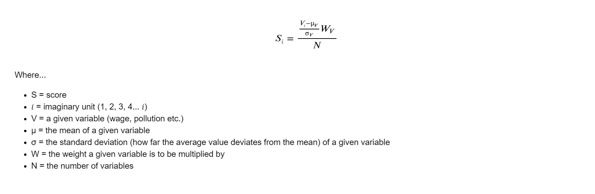

```{r setup, include=FALSE}

library(tidyverse)
library(dplyr)
library(ggplot2)
library(ggthemes)
library(tidyverse)
library(gridExtra)

# gets the z scores. 
get_z_scores <- function(col) {
  avg <- mean(col)
  sd <- sd(col)
  z_scores <- list()
  for(i in 1:length(col)) {
    z_scores[i] <- (col[i] - avg) / sd
  }
  return(unlist(z_scores))
}

# gets the index averages. 
get_avg <- function(z_scores) {
  measures = tibble(z_scores = character())
  for(i in 1:length(z_scores)) {
    measures[i,] = z_scores[i]
  }
  measure_length <- nrow(measures)
  row_length <- length(eval(parse(text=z_scores[1])))
  
  data <- tibble(city=cities)
  for(i in 1:measure_length) {
    data[,i+1] <- eval(parse(text=z_scores[i]))
  }
  avg <- list()
  for(i in 1:row_length) {
    avg[i] <- rowMeans(data[i,-1])
  }
  return(unlist(avg))
}

# a list of cities to be analyzed
cities <- c("London", "Amsterdam", "Geneva", "Berlin",
            "Barcelona", "Madrid", "Lisbon", "Rome",
            "Vancouver", "Toronto", "New York", "San Franscisco",
            "Singapore", "Shanghai", "Tokyo", "Seoul",
            "Wellington", "Auckland", "Sydney", "Melbournne",
            "Buenos Aires", "Bogota", "Rio de Janeiro", "Sao Paulo")


# a list of corresponding regions 
regions <- c(rep("Northern Europe", 4), rep("Southern Europe", 4), rep("North America", 4), rep("Asia", 4), rep("Australasia", 4), rep("South America", 4))


# 1) Wikepedia - km2 - https://www.wikipedia.org/
population_density <- get_z_scores(c(5598, 4908, 12000, 4048,
                                     16000, 5337, 5445.7, 2236,
                                     5749, 4427.8, 10194, 6655.4,
                                     7804, 4200, 6363, 16000,
                                     900, 1210, 2037, 503.472,
                                     13680, 17755, 5377, 7216.3))

# 2) Numbeo - Average Monthly Net Salary (After Tax) USD - https://www.numbeo.com/cost-of-living/city_price_rankings?itemId=105
average_wage <- get_z_scores(c(4238.68, 4195.81, 6171.96, 3448.71,
                               2039.94, 2804.49, 1247, 1942.00,
                               3288.54, 3356.11, 6530.28, 6133.08,
                               5117.62, 1355.62, 2630.64, 2966.22,
                               2644.28, 3326.10, 4109.44, 3465.38,
                               403.17, 364.45, 399.80, 491.76))

# 3) Numbeo - Cost of Living Index - https://www.numbeo.com/cost-of-living/rankings_current.jsp
cost_of_living <- get_z_scores(c(85.5, 69.9, 116.4, 72.3,
                                 59.2, 53.9, 53.7, 66.1,
                                 73.9, 73.0, 100.0, 97.7,
                                 87.3, 43.6, 58.4, 78.0,
                                 76.2, 79.2, 82.4, 80.3,
                                 30.0, 29.7, 42.3, 44.1))

# 4) HUGSI - global ranking - https://www.hugsi.green/ranking
green <- get_z_scores(c(91, 233, 53, 125,
                        96, 239, 95, 147,
                        105, 110, 242, 256,
                        213, 141, 263, 227,
                        188, 188, 180, 203,
                        264, 267, 134, 211))

# 5) Worldwide Governance Indicators - 2020 Estimate - z scores - https://info.worldbank.org/governance/wgi/
government <- get_z_scores(c(1.38, 1.85, 2.02, 1.36,
                             0.89, 0.89, 1.02, 0.4,
                             1.64, 1.64, 1.32, 1.32,
                             2.34, 0.65, 1.6, 1.42,
                             1.59, 1.59, 1.62, 1.62,
                             -0.22, 0.04,-0.447, -0.447))

# 6) Numbeo - Safety Index 2023 - https://www.numbeo.com/crime/rankings.jsp
saftey <- get_z_scores(c(46.1, 70.9, 69.4, 56.5,
                         49.3, 72.5, 66.9, 46.9,
                         59.1, 57.3, 50.5, 38.6,
                         76.9, 69.7, 76.0, 75.2,
                         66.5, 50.7, 65.7, 56.0,
                         36.8, 33.8, 22.4, 29.4))

# 7) Numbeo - pollution index 2023 - https://www.numbeo.com/pollution/rankings.jsp
pollution <- get_z_scores(c(57.7, 25.1, 25.5, 39.4,
                            65.2, 40.0, 27.7, 117.8,
                            26.6, 37.2, 57.9, 50.2,
                            33.0, 73.1, 42.6, 58.9,
                            22.8, 31.0, 30.5, 28.4,
                            52.4, 70.2, 67.4, 79.0))

# 8) Wikepedia - cities by sunshine duration - https://en.wikipedia.org/wiki/List_of_cities_by_sunshine_duration
sunshine <- get_z_scores(c(1633, 1662, 1887, 1626,
                           2591, 2769, 2806, 2473,
                           1937.6, 2066.4, 2534.7, 3061.7,
                           2022.4, 1775.8, 1876.7, 2066.0,
                           2058.7, 2003.1, 2468.1, 2362.6,
                           2525.2, 1328.0, 2187.3, 1893.5))

# 9) the global economy - Political stability index - https://www.theglobaleconomy.com/rankings/wb_political_stability/
stability <- get_z_scores(c(0.54, 0.92, 1.13, 0.76,
                            0.58, 0.58, 0.95, 0.58,
                            0.94, 0.94, 0, 0,
                            1.49, -0.48, 1.03, 0.66,
                            1.44, 1.44, 0.85, 0.85,
                            -0.11, -0.91, -0.49, -0.49))


# make bad things or rankings negative
population_density <- -population_density
cost_of_living <- -cost_of_living
green <- -green
pollution <- -pollution


# weights
weight_1 <- 2
Weight_2 <- 1.5


# times the most important (psychological/mental health based) factors by 3
population_density <- population_density*weight_1
green <- green*weight_1
pollution <- pollution*weight_1


# times the next most important factors by 2
saftey <- saftey*Weight_2
government <- government*Weight_2
stability <- stability*Weight_2


# a list of non-adjusted indicators to be averaged for a total score (categories plots)
indicators <- c("population_density", "average_wage", "cost_of_living", 
                "green", "government", "saftey", 
                "pollution", "sunshine", "stability")


# returns the row averages of multiple columns. 
get_avg <- function(z_scores) {
  measures = tibble(z_scores = character())
  for(i in 1:length(z_scores)) {
    measures[i,] = z_scores[i]
  }
  measure_length <- nrow(measures)
  row_length <- length(eval(parse(text=z_scores[1])))
  
  data <- tibble(city=cities)
  for(i in 1:measure_length) {
    data[,i+1] <- eval(parse(text=z_scores[i]))
  }
  avg <- list()
  for(i in 1:row_length) {
    avg[i] <- rowMeans(data[i,-1])
  }
  return(unlist(avg))
}


# creates a dataframe of the non-adjusted data. 
df <- tibble("City" = cities,
             "Region" = regions,
             "Population Density" = population_density,
             "Average Wage" = average_wage,
             "Cost of Living" = cost_of_living,
             "Green" = green,
             "Government" = government,
             "Saftey" = saftey,
             "Pollution" = pollution,
             "Sunishine" = sunshine,
             "Stability" = stability,
             "Total" = get_avg(indicators))


# creates a personal theme for data visualization. 
my_theme <- theme_economist_white(gray_bg = FALSE) +
  theme(plot.title = element_text(hjust = 0.5,
                                  vjust = 10,
                                  size = 10,
                                  color = "#474747"),
        plot.margin = unit(c(1.5, 1, 1.5, 1), "cm"),
        axis.text = element_text(size = 9,
                                 color = "gray30"),
        axis.text.x=element_text(vjust = -2.5),
        axis.title.x = element_text(size = 9,
                                    color = "gray30",
                                    vjust = -10),
        axis.title.y = element_text(size = 9,
                                    color = "gray30",
                                    vjust = 10),
        legend.direction = "vertical", 
        legend.position = "right",
        legend.title = element_blank(),
        legend.text = element_text(size = 9,
                                   color = "gray20"),
        legend.margin=margin(0, 0, 0, 5),
        legend.spacing.x = unit(0.5, "cm"),
        legend.key.size = unit(0.5, "cm"), 
        legend.key.height = unit(0.5, "cm"),
        strip.text = element_text(hjust = 0.5,
                                  vjust = 1,
                                  size = 10,
                                  color = "#474747"),
        panel.spacing = unit(2, "lines"))

```

## **Summary**
The movie Sweet Home Alabama touches on the tension some face between big city life and the benefits of somewhere smaller that feels more like home. But what if you could have the benefits of living in a major global city with less of the negative side effects? Are some international hubs better than others when it comes to quality of life? This project uses data from a range of sources to tackle that question. The answer is yes.

&nbsp;

```{r, echo = FALSE, message = FALSE, warning = FALSE, dpi=600}

# total score 
df %>%
  ggplot(aes(x = reorder(City, -Total), y=Total, fill = "red")) +
  geom_bar(stat = "identity", position = "dodge") +
  ggtitle("Quality of life") +
  ylab("Z-Score") +
  my_theme + 
  theme(axis.title.x=element_blank(),
        legend.position="none",
        axis.text.x = element_text(angle = 45, vjust = 0.5, hjust=1))


```

```{r, echo = FALSE, message = FALSE, warning = FALSE, dpi=600, fig.height=8}

y_lim <- c(-2.25, 1)

# Northern Europe 
p1 <- df %>%
  filter(Region == "Northern Europe") %>%
  ggplot(aes(x = City, y = Total, fill = City)) +
  geom_bar(stat = "identity", position = "dodge") +
  ggtitle("Northern Europe") +
  ylab("Z-Score") +
  ylim(y_lim) +
  my_theme + 
  theme(axis.title.x=element_blank(),
        axis.text.x = element_blank())

# Southern Europe 
p2 <- df %>%
  filter(Region == "Southern Europe") %>%
  ggplot(aes(x = City, y = Total, fill = City)) +
  geom_bar(stat = "identity", position = "dodge") +
  ggtitle("Southern Europe") +
  ylab("Z-Score") +
  ylim(y_lim) +
  my_theme + 
  theme(axis.title.x=element_blank(),
        axis.text.x = element_blank())

# North America 
p3 <- df %>%
  filter(Region == "North America") %>%
  ggplot(aes(x = City, y = Total, fill = City)) +
  geom_bar(stat = "identity", position = "dodge") +
  ggtitle("North America ") +
  ylab("Z-Score") +
  ylim(y_lim) +
  my_theme + 
  theme(axis.title.x=element_blank(),
        axis.text.x = element_blank())

# categories Asia 
p4 <- df %>%
  filter(Region == "Asia") %>%
  ggplot(aes(x = City, y = Total, fill = City)) +
  geom_bar(stat = "identity", position = "dodge") +
  ggtitle("Asia") +
  ylab("Z-Score") +
  ylim(y_lim) +
  my_theme + 
  theme(axis.title.x=element_blank(),
        axis.text.x = element_blank())

# categories Australasia 
p5 <- df %>%
  filter(Region == "Australasia") %>%
  ggplot(aes(x = City, y = Total, fill = City)) +
  geom_bar(stat = "identity", position = "dodge") +
  ggtitle("Australasia") +
  ylab("Z-Score") +
  ylim(y_lim) +
  my_theme + 
  theme(axis.title.x=element_blank(),
        axis.text.x = element_blank())

# categories South America 
p6 <- df %>%
  filter(Region == "South America") %>%
  ggplot(aes(x = City, y = Total, fill = City)) +
  geom_bar(stat = "identity", position = "dodge") +
  ggtitle("South America ") +
  ylab("Z-Score") +
  ylim(y_lim) +
  my_theme + 
  theme(axis.title.x=element_blank(),
        axis.text.x = element_blank())


grid.arrange(p1, p2, p3, p4, p5, p6)

```

&nbsp;

## **Method**

The quality of life metric includes the following variables:

- population density
- average wage
- cost of living
- sustainability
- government effectivness
- saftey
- pollution
- hours of sun
- political stability

&nbsp;

The z-score for each data distribution is calculated and multiplied by a weight before being added together and divided by the number of variables to get a total score. The weights are determined by order of importance according to the modeler's personal preferences. 

&nbsp;
&nbsp;



&nbsp;

#### Weights  

##### Psychological factors  
- population density, sustainability and pollution  
- weight = x2

##### Security factors  
- safety, stability and government effectiveness  
- weight = x1.5

##### Other factors  
- average wage, cost of living and hours of sun  
- weight = x1


&nbsp;

## **Sources**

1) Population density --- km2  
Wikepedia  
https://www.wikipedia.org/  

2) Average Monthly Net Salary (After Tax) --- USD  
Numbeo  
https://www.numbeo.com/cost-of-living/city_price_rankings?itemId=105

3) Cost of Living Index  
Numbeo  
https://www.numbeo.com/cost-of-living/rankings_current.jsp

4) Global sustainability ranking  
HUGSI  
https://www.hugsi.green/ranking

5) 2020 Government Effectivenss --- Z-scores  
Worldwide Governance Indicators  
https://info.worldbank.org/governance/wgi/

6) Safety Index 2023  
Numbeo  
https://www.numbeo.com/crime/rankings.jsp

7) Pollution index 2023  
Numbeo  
https://www.numbeo.com/pollution/rankings.jsp

8) Cities by sunshine duration  
Wikepedia  
https://en.wikipedia.org/wiki/List_of_cities_by_sunshine_duration

9) Political stability index  
The Global Economy  
https://www.theglobaleconomy.com/rankings/wb_political_stability/  

&nbsp;