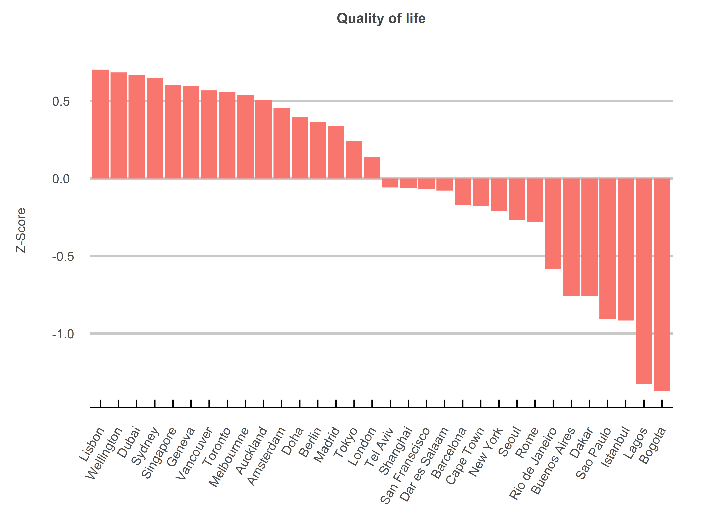
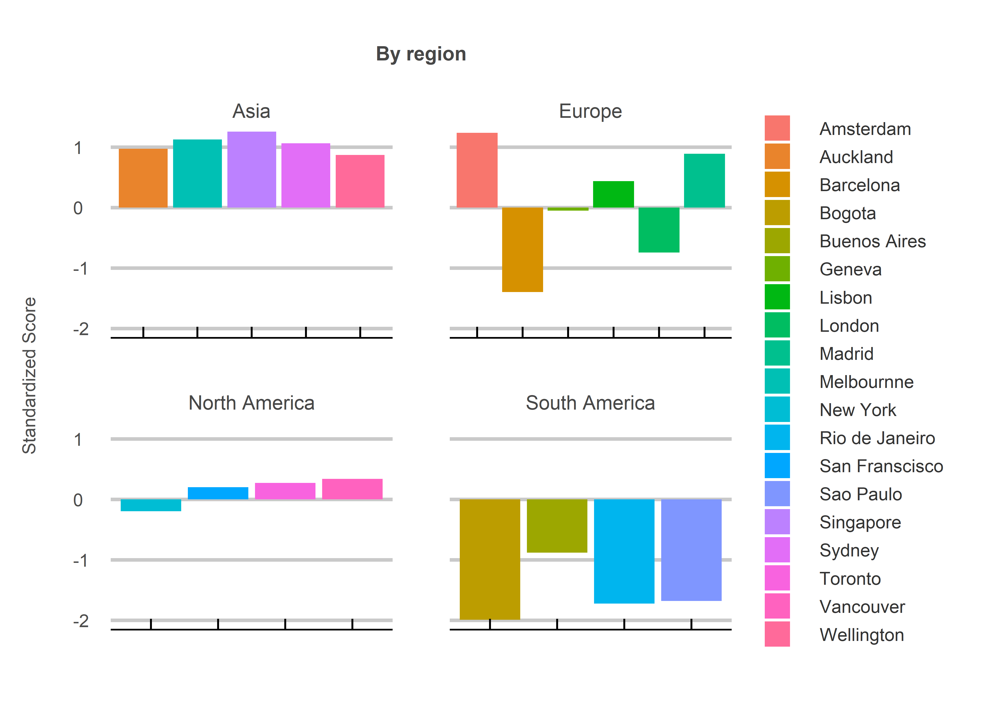

Sweet Home Alabama
================
Jack Carter
18/07/2023

## **Summary**

The movie Sweet Home Alabama touches upon the tension between big city
life and somewhere that feels like home. But what if you could have the
benefits of a major city with less of the negative side effects? Are
some global cities better than others? This project uses data from a
range of sources to answer that question.

 

<!-- -->

<!-- -->

 

## **Method**

The z-score for each data distribution is calculated and multiplied by a
weight before being added together to get a total score. The weights are
determined by order of importance as follows:

 

##### Psychological factors

  - population density, sustainability and pollution  
  - weight = x3

##### Security factors

  - safety, stability and government effectiveness  
  - weight = x2

##### Physical factors

  - average wage, cost of living and hours of sun  
  - weight = x1

 

## **Sources**

1)  Population density — km2  
    Wikepedia  
    <https://www.wikipedia.org/>

2)  Average Monthly Net Salary (After Tax) — USD  
    Numbeo  
    <https://www.numbeo.com/cost-of-living/city_price_rankings?itemId=105>

3)  Cost of Living Index  
    Numbeo  
    <https://www.numbeo.com/cost-of-living/rankings_current.jsp>

4)  Global sustainability ranking  
    HUGSI  
    <https://www.hugsi.green/ranking>

5)  2020 Government Effectivenss — Z-scores  
    Worldwide Governance Indicators  
    <https://info.worldbank.org/governance/wgi/>

6)  Safety Index 2023  
    Numbeo  
    <https://www.numbeo.com/crime/rankings.jsp>

7)  Pollution index 2023  
    Numbeo  
    <https://www.numbeo.com/pollution/rankings.jsp>

8)  Cities by sunshine duration  
    Wikepedia  
    <https://en.wikipedia.org/wiki/List_of_cities_by_sunshine_duration>

9)  Political stability index  
    The Global Economy  
    <https://www.theglobaleconomy.com/rankings/wb_political_stability/>
