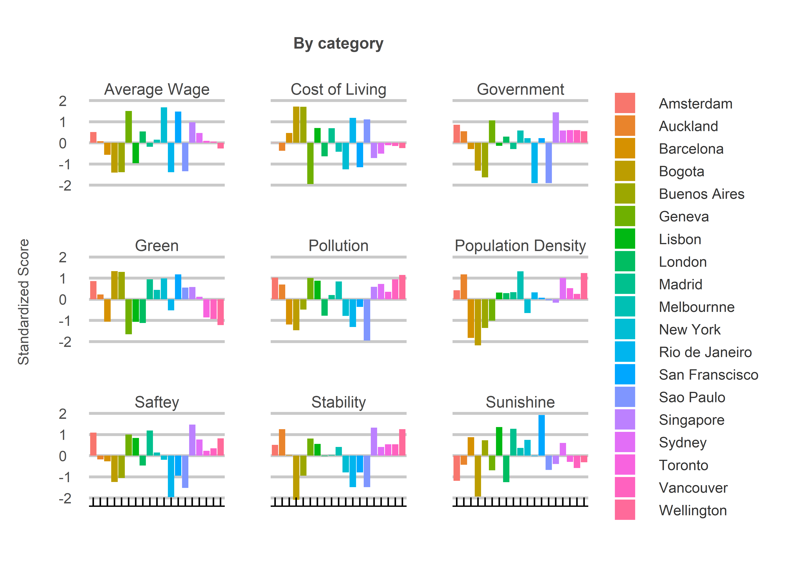

Sweet Home Alabama
================
Jack Carter
18/07/2023

## **Summary**

The movie Sweet Home Alabama is all about the tension between big city
life and home. But what if you could have the benefits of a major global
city with less of the negative side effects? Are some of cities better
than others? This project uses data from a range of sources to arrive at
the answer, yes.

 

<!-- -->

<!-- -->

<!-- -->
