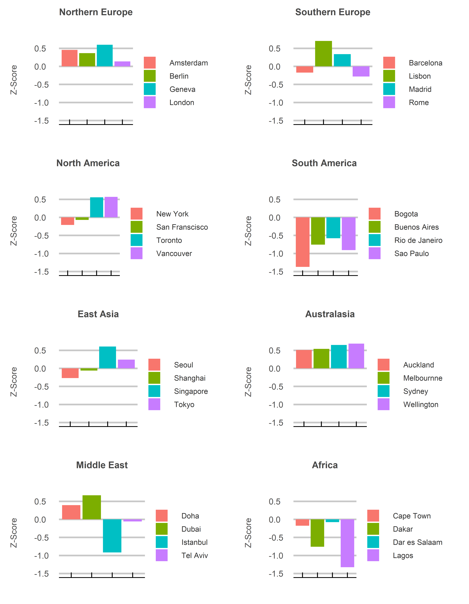
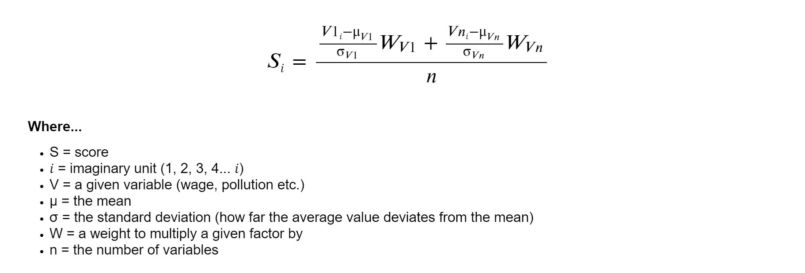

Sweet Home Alabama
================
Jack Carter
18/07/2023

## **Summary**

The movie Sweet Home Alabama touches on the tension some face between
big city life and the benefits of somewhere smaller that feels more like
home. But what if you could have the benefits of living in a major city
with less of the negative side effects? Are some global hubs better than
others when it comes to quality of life? This project uses data from a
range of sources to tackle that question. The answer is yes.

 

<!-- -->

 

<!-- -->

 

## **Method**

The quality of life metric includes the following variables:

  - population density
  - average wage
  - cost of living
  - sustainability
  - government effectiveness
  - safety
  - pollution
  - hours of sun
  - political stability

 

The z-score for each data distribution is calculated and multiplied by a
weight before being added together and divided by the number of
variables to get a total score. The weights are determined by order of
importance according to the modeler’s preferences.

   

   

#### Weights

##### Psychological well-being x1.5

  - population density
  - sustainability
  - pollution

##### Security and government x1.25

  - safety
  - political stability  
  - government effectiveness

##### Purchasing power and weather x1

  - average wage
  - cost of living
  - hours of sun

   

## **Sources**

1)  Population density — km2  
    Wikepedia  
    <https://www.wikipedia.org/>

2)  Average Monthly Net Salary (After Tax) — USD  
    Numbeo  
    <https://www.numbeo.com/cost-of-living/city_price_rankings?itemId=105>

3)  Cost of Living Index  
    Numbeo  
    <https://www.numbeo.com/cost-of-living/rankings_current.jsp>

4)  Global sustainability ranking  
    HUGSI  
    <https://www.hugsi.green/ranking>

5)  2020 Government Effectivenss — Z-scores  
    Worldwide Governance Indicators  
    <https://info.worldbank.org/governance/wgi/>

6)  Safety Index 2023  
    Numbeo  
    <https://www.numbeo.com/crime/rankings.jsp>

7)  Pollution index 2023  
    Numbeo  
    <https://www.numbeo.com/pollution/rankings.jsp>

8)  Cities by sunshine duration  
    Wikepedia  
    <https://en.wikipedia.org/wiki/List_of_cities_by_sunshine_duration>

9)  Political stability index  
    The Global Economy  
    <https://www.theglobaleconomy.com/rankings/wb_political_stability/>
